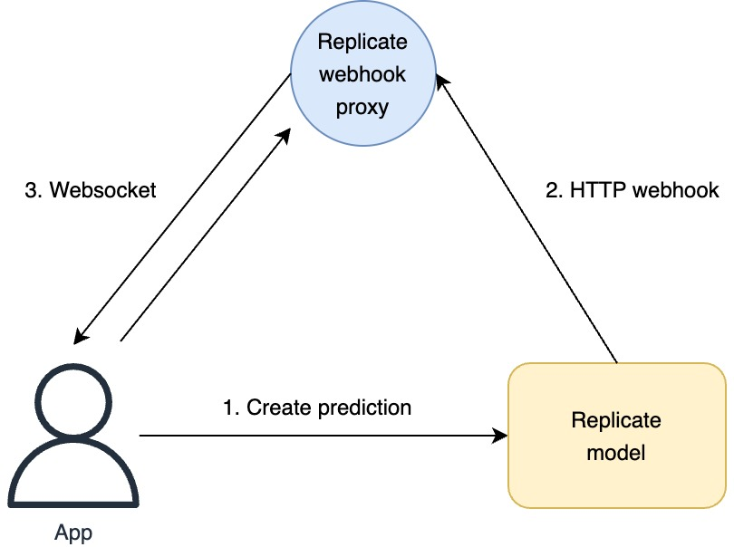

# Disclaimer: Project is shut down and does not work!

# Replicate Webhook Proxy

Receive your [Replicate webhook](https://replicate.com/docs/webhooks) events through a websocket connection, right in your browser or Node.js code!

## Installation

```sh
npm install replicate-webhook-proxy
```

## Usage

Specify the following URL when [creating a Replicate prediction](https://replicate.com/docs/reference/http#predictions.create):

```sh
https://r3swiuknhh.execute-api.eu-west-1.amazonaws.com/prod/webhook?key=my_key
```

Change the `key` query parameter to a unique key / password. Then, in your browser / Node.js code:

```js
// Import module
const rwp = require("replicate-webhook-proxy");

// Create a websocket client with a key / password used in the prediction webhook URL
const client = rwp("my_key");

// Setup event listeners
client.on("open", () => console.log("onopen"));
client.on("close", () => console.log("onclose"));
client.on("message", (event) => console.log("onmessage", event.data));
client.on("error", (event) => console.log("onerror", event.message));
```

The `message` event returns an `event.data` property with the following structure:

```js
{
  query: {
    key: "my_key"
    // Other query string parameters in the webhook URL
  },
  body: {
    // Replicate prediction data
  }
}
```

## Why?

To receive HTTP webhook requests you need a publicly accessible endpoint on the internet. This is easy if you have a web server already exposed to the internet, but not if you're using a local computer. You can use tools such as [ngrok](https://ngrok.com/), but they require a separately running process that opens a proxy tunnel to your computer.

This NPM package let's you connect to a websocket endpoint and receive webhook event, right in your broweser or Node.js code!

## How?

A proxy in the middle will receive HTTP webhooks from a running Replicate model and relay them via Websockets to the client application.


